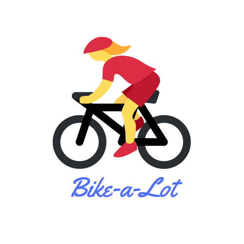

    

Bike-a-lot
---
NodeJS alexa skill for tracking and rewarding consistent cycling.

Submitted for the 2018 AWS Alexa Skill challenge - <a href="https://alexatechforgood.devpost.com/">Tech for Good</a>

Going after challenges:
* Best Use of Advanced Alexa Developer features: <b>(persistence)</b>.
* Best Natural Resource Efficiency Skill (tracking and encouraging community biking).
* Best Use of Open-sourced Data (using open source biking facts to help users find reasons for biking).

### Usage
You can ask the bike-a-lot alexa skill to do the following actions.

* <b>Give a biking fact</b>: Alexa, ask bike-a-lot for a biking fact.
* <b>Track a ride</b>: Alexa, ask bike-a-lot to track my ride of 20 miles.
* <b>Give a ride summary report</b>: Alexa, ask bike-a-lot for my biking report.

### Useful links
* http://www.ilovebicycling.com/biking-facts/