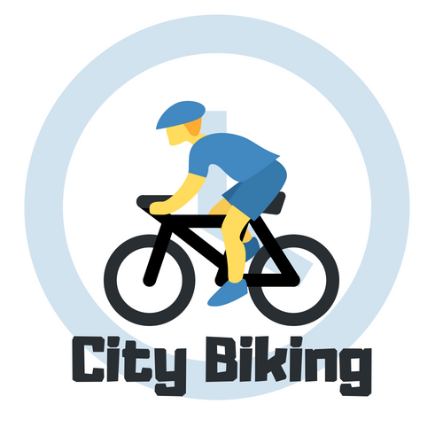

    

City Biking
---
NodeJS alexa skill for finding information on city bikes in your town.

### Concept

You can ask the city biking alexa skill for information on the number of city bikes at stations across the United States.
This alexa skill will understand fuzzy queries about particular streets and locations, and give you the number of free bikes at that location in real time.

Works in most major US cities.

Submitted for the 2018 AWS Alexa Skill challenge - <a href="https://alexatechforgood.devpost.com/">Tech for Good</a>

#### Going after challenges:
* Best Use of Advanced Alexa Developer features: <b>(persistence)</b>.
* Best Natural Resource Efficiency Skill (tracking and encouraging community biking).
* Best Sustainable Transportation Skill
* Best Use of Open-sourced Data (using open source biking facts to help users find reasons for biking).

### Usage
You can ask the city biking alexa skill for information on the number of city bikes at stations across the United States.

* <b>Alexa, ask city biking for city bikes in Los Angeles.</b>
* <b>Alexa, ask city biking about city bikes in Boston.</b>
 
etc...

#### Bonus:
This skill can also give you healthy biking tips.

* <b>Alexa, ask city biking for a biking fact.</b>

### Useful links
* http://www.ilovebicycling.com/biking-facts/
* https://api.citybik.es/v2